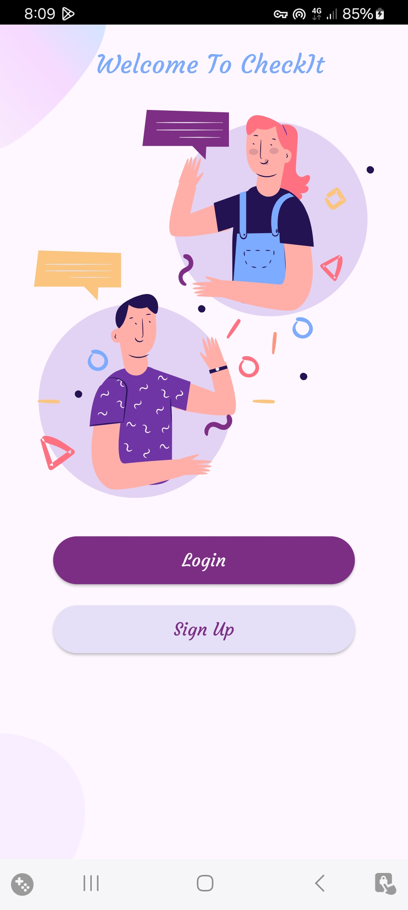
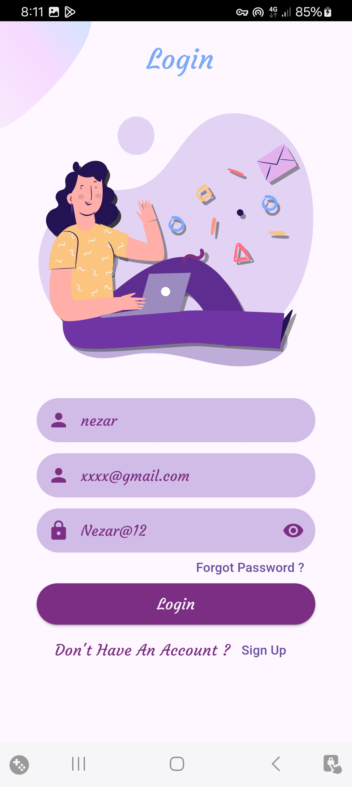
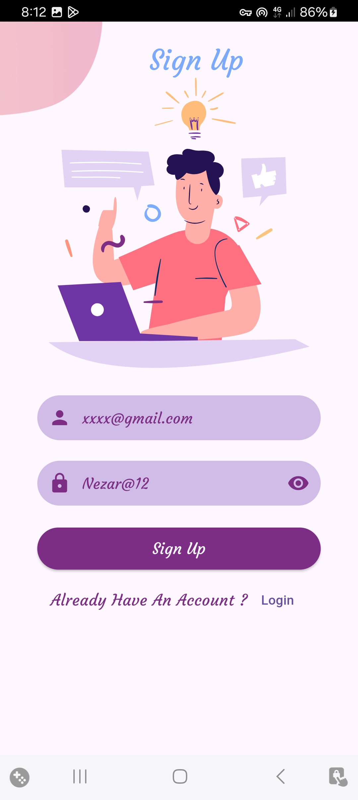
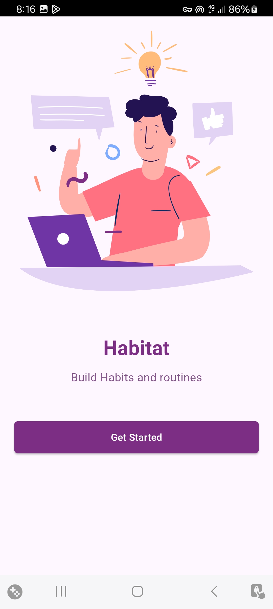
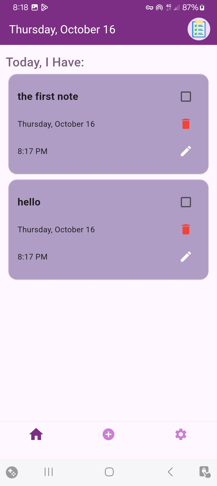
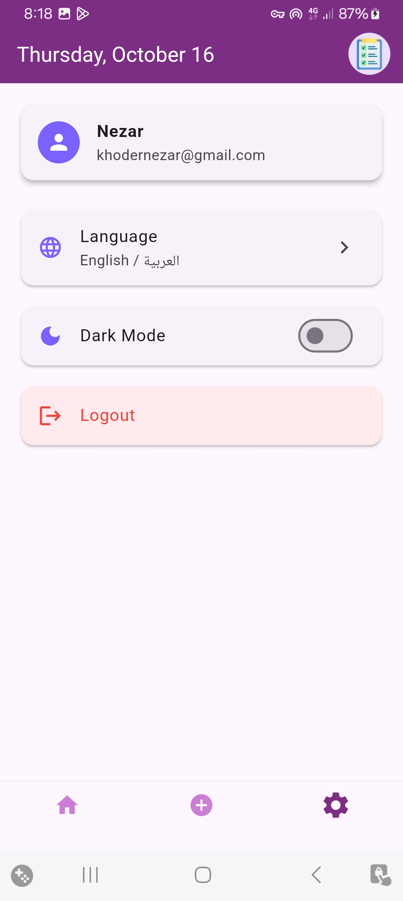
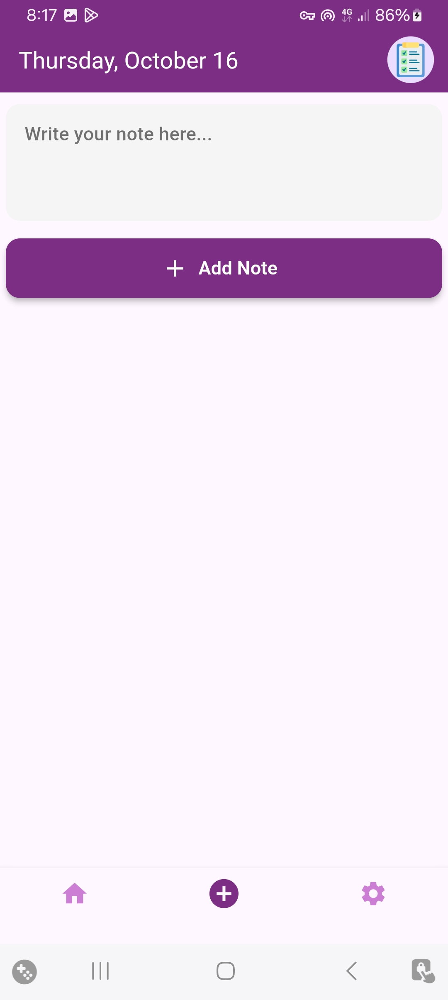

# 📝 Flutter Notes App

A Flutter application that allows users to create, edit, and manage their personal notes.  
The app includes authentication, language switching (English & Arabic), dark/light themes, and a clean modern design.

---

## 🚀 Features

- 🔐 User authentication with **Firebase** (Sign Up / Login / Logout)  
- 🗒️ Add, edit, and delete notes  
- 🌙 Switch between **Dark** and **Light** themes  
- 🌍 Multi-language support (**English / Arabic**)  
- ⚙️ Settings page displaying user info and app preferences  
- ⚡ State management with **GetX**

---

## 🧰 Technologies Used

- **Flutter**  
- **Dart**  
- **Firebase Authentication & Firestore**  
- **GetX** for state management  

---

## 📱 Screenshots

<p align="center">
  
  
  
</p>

<p align="center">
  
  
  
  
</p>

---

## 🧑‍💻 Getting Started

1. Clone this repository:
   ```bash
   git clone https://github.com/your-username/your-repo-name.git
